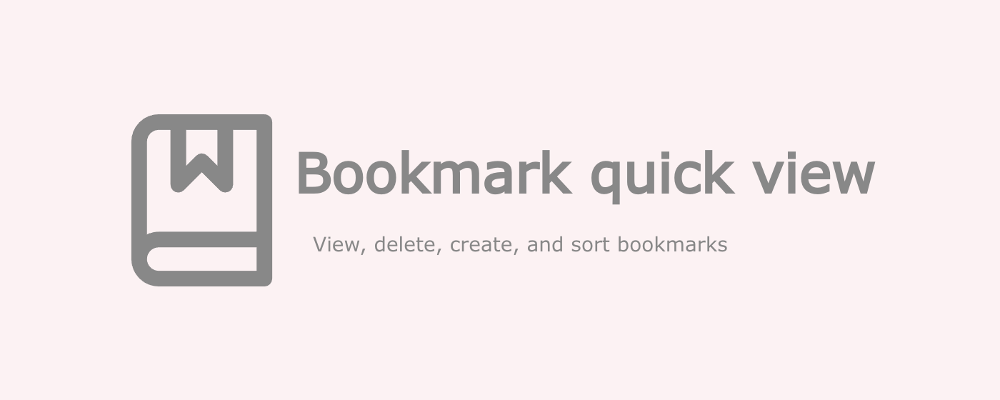

###  v0.2.0
created by Axel Ariel Saravia

---

[*Bookmarks quick view*](https://chromewebstore.google.com/detail/bookmarks-quick-view/oboploabbffifnkmiipmbpoaihabhjpm)
is a simple chrome extension for use and manage simple tasks with your browser bookmarks.

This extension is created for my own necessities. If you have some bugs or you need other utilities please contact me.

### Some of the usabilities are:
- see all your bookmarks and bookmark folders.
- delete a bookmark or a folder.
- create folders.
- add the current tab as bookmark in any folder.
- open a complete folder in the current, new or private windows.
- sort by name.
- sort folders before bookmarks.
- shortcut button to the bookmark manager

### Some user configurations:
- You can set if the url opens in the current tab or in a new tab.
- You can specify when a new tab is opens, go to it (focus it) or stay in your current tab.
- You can decide if folders sort before bookmarks or not
- You can decide if the created bookmark or folder adds to the beginning of the parent folder.

### Some keyboard shortcuts:

| Command | Description |
| --- | ---|
| <kbd>Tab</kbd> | normal navigation. |
| <kbd>Space</kbd> | open and lcose folders. |
| <kbd>Enter</kbd> | open and close folders or open a link. |
| <kbd>Ctrl</kbd> + <kbd>q</kbd> | close any kind of modal. |
| <kbd>Ctrl</kbd> + <kbd>c</kbd> | copy folder title or link url on clipboard. |
| <kbd>d</kbd> | focus the parent folder. |
| <kbd>Ctrl</kbd> + <kbd>Enter</kbd> | on links, opens the link in a contrary way that the open behavior |
| <kbd>Ctrl</kbd> + <kbd>mouse click</kbd> | on links, opens the link in a contrary way that the open behavior |
| <kbd>Shift</kbd> + <kbd>Enter</kbd> | on links, opens the link in a new windows |
| <kbd>Shift</kbd> + <kbd>mouse click</kbd> | on links, opens the link in a new windows |
| <kbd>f</kbd> | create new folder inside the current folder. |
| <kbd>Shift</kbd> + <kbd>f</kbd> | create new folder inside the parent folder. |
| <kbd>b</kbd> | create new bookmark inside the current folder. |
| <kbd>Shift</kbd> + <kbd>b</kbd> | create new bookmark inside the parent folder. |
| <kbd>v</kbd> | opens the "create bookmark modal" with empty fields to create a new bookmark inside the current folder. |
| <kbd>Shift</kbd> + <kbd>v</kbd> | opens the "create bookmark modal" with empty fields to create a new bookmark inside the parent folder. |
| <kbd>r</kbd> | remove link or folder. |
| <kbd>e</kbd> | edit folder or link. |
| <kbd>u</kbd> | undo last remove link or folder (in the undo timeout). |
| <kbd>s</kbd> | sort the current folder. |
| <kbd>Shift</kbd> + <kbd>s</kbd> | sort the parent folder. |
| <kbd>o</kbd> | on foldres, open all links in the current folder. |
| <kbd>Shift</kbd> + <kbd>o</kbd> | on folders, open all links in the current folder in a new window. |
| <kbd>Shift</kbd> + <kbd>i</kbd> | on folders, open all links in the current folder in a incognito window. |
| <kbd>m</kbd> | open or close the "more modal". |
| <kbd>k</kbd> | open or close the "keyboard modal". |
---

The icons used in the extension are from
[Feather Icons](https://feathericons.com/) and
[Lucide](https://lucide.dev/).

The inspiration of this extension comes from the [Edge Browser](https://www.microsoft.com/en-us/edge) bookmark extension.
