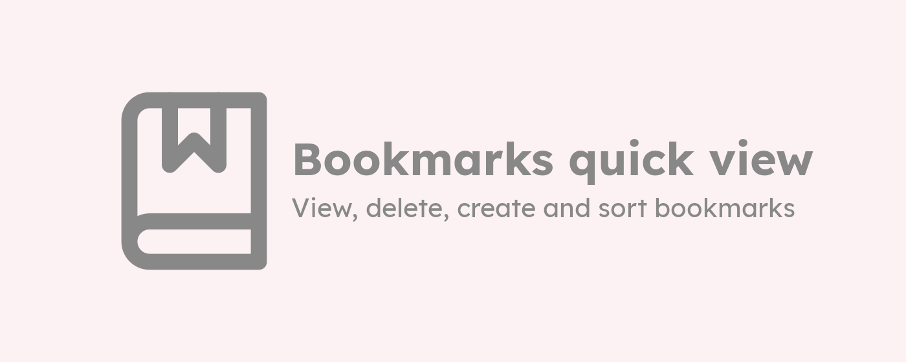

### 
created by Axel Ariel Saravia

---

[*Bookmarks quick view*](https://chrome.google.com/webstore/detail/bookmarks-quick-view/oboploabbffifnkmiipmbpoaihabhjpm?hl=en) is a simple chrome extensions for use and manage simple tasks with your browser history data.

This extension is created for my own necessities. If you have some bugs or you need other utilities please contact me.

### Some of the usabilities are:
- see all your bookmarks and bookmark folders.
- delete a bookmark or a folder.
- create folders.
- add the current tab as bookmark in any folder.
- open a complete folder in the current, new or private windows.
- sort A-Z.
- sort folders before bookmarks.
- shortcut button to the bookmark manager

### Some user configurations:
- You can set if the url opens in the current tab or in a new tab.
- You can specify when a new tab is opens, go to it (focus it) or stay in your current tab.
- You can decide if folders sort before bookmarks or not

### Some keyboard shortcuts:

| Command | Description |
| --- | ---|
| <kbd>Ctrl</kbd> + <kbd>Enter</kbd> or <kbd>Ctrl</kbd> + mouse click| Opens the url in a contrary way of the configurations
| <kbd>Shift</kbd> + <kbd>Enter</kbd> or <kbd>Shift</kbd> + mouse click| Opens the url in a new windows |

---

The icons used in the extension are from [Feather Icons](https://feathericons.com/).

The inspiration of this extension comes from the [Edge Browser](https://www.microsoft.com/en-us/edge) bookmark extension.
